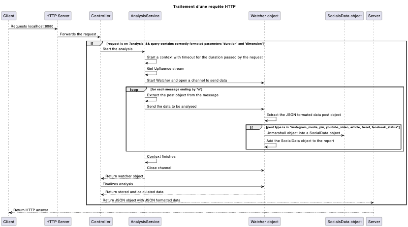

# Uplfuence analysis-api

This document aims at centralizing all the informations regarding this piece of sofwtare.

# Introduction

The API aims to provide an analysis report on the social media posts that were processed by Upfluence and published on its SSE stream at https://stream.upfluence.co/stream.

The user can only contact the API via the `GET /analysis` route and must provide two parameters in the query:
- `duration`: the duration for the analysis to run, using a format that can be parsed and transformed into a duration, e.g. `20s` for a 20-second analysis, `2m` for 2 minutes, `4h` for 4 hours.
- `dimension`: the type of stat the user wants to analyze across all posts processed by Upfluence. It can only be one of:
    - `pin`
    - `instagram_media`
    - `youtube_video`
    - `article`
    - `tweet`
    - `facebook_status`

The API is currently configured to run on port `8080`; any change to this should be reflected in the automation files (`Dockerfile`, `docker-compose.yml`).

## Technical choices

### Sequence diagram

This document summarises the processing of a request to the `/analysis` route.




### API framework

The API only uses the Go standard library to operate, except for its HTTP server and request handling, in order to be quicker to write.

I selected the `Gin` framework to perform these tasks, Gin being the go-to tool in the Go community to quickly set up APIs. It prevented me from spending too much time writing a lot of boilerplate code and allowed me to ship a solution quickly. The trade-off for this is the bloat Gin brings to the project; in the `go.mod`, we can see that the only imported package requires 20+ other packages.

I had never used Gin previously, having worked only with `beego`, which is an interesting choice for its route-creation-over-comments and Swagger generation features, but that would be a bit too overkill for this particular project.

### Architecture

The project uses a simple API architecture where the router is located in the main file for simplicity reasons; controllers, services, and models are then separated in order to make the code more readable and keep classes and methods short.

The controller is responsible for ensuring that the received queries are well formatted, i.e. contain the required parameters with appropriate formats. It then uses the `analysis` service to contact the Upfluence stream and retrieve the data returned to the client.

All the “business” logic is located in a single service, although different methods handle the various steps of the data retrieval process. The service relies on the `watcher` struct to handle the useful data it extracts and to store it.

Two types of models are used here:
- `watcher`: it is instantiated to store the nature of the client’s request through the `TargetDimension` attribute and to store the retrieved data that fits the client’s request.
- `SocialsData`: it uses Go’s tag feature to store information found in any post (`id` and `timestamp`) and to transparently retrieve any of the dimensions we are interested in (likes, comments, favorites, retweets) when a JSON-structured object is unmarshaled into it.

The Analysis and Watcher communicate through a channel where each message is parsed and fed to a new goroutine in charge of processing the post’s data. With this approach, we ensure that the processing is non-blocking, allowing the service to handle a fast input of events.

## Critical analysis : 

In this part I will try to analyse the weaknesses of the delivered code.

### Improvements 

Using the Gin package to handle the HTTP server and requests comes with an increased binary size. While the project is quite small and only consists of one route, it imports a lot of dependencies. The resulting image, while embedding a minimal environment using `SCRATCH`, is still almost 10 MB. Using this environment also reduces the possibilities for interacting with the container’s environment, notably due to the lack of a shell like `bash` or `sh`.

The solution would suffer from any downtime, even the shortest, in the stream provided by Upfluence to retrieve the data. Should the stream cut, I have not implemented a way for the solution to detect it and wait for the stream to become available again. I assume this would result in an internal error and a `500` response. The solution is also not capable of detecting and logging this event **precisely**.

It also lacks proper detection and logging of any malformed data. I had thought that the `logger` class could implement a method to store processing errors and add this information as another report in the final response, should any exist.

Finally, I observed, using the small test in `tests/test_charge_increase.go`, that when a very large number of requests are handled at the same time (above 100), the API suffers from problems establishing a TLS connection to the Upfluence stream. This might be handled by buffering the requests.

### Tests

Unfortunately, I have never used Go’s testing module. I did not want to spend a lot of time learning how to use it, only for the final implementation to be of poor quality due to my inexperience.  

However, I used progressive testing while writing the code, starting with the implementation of the models, then the service, and finally the controller. I also generated data to test the solution in the `tests` directory.

## Deployment

The solution can be deployed either directly on the host machine 

```
(inside the cloned directory)
go mod download
go run .

or 

go build . && ./analysis-api
```

or in a docker container 

```
(inside the cloned directory)
docker build . -t analysis-api
docker compose up (-d if you don't want to logs to appear in your terminal)
```

